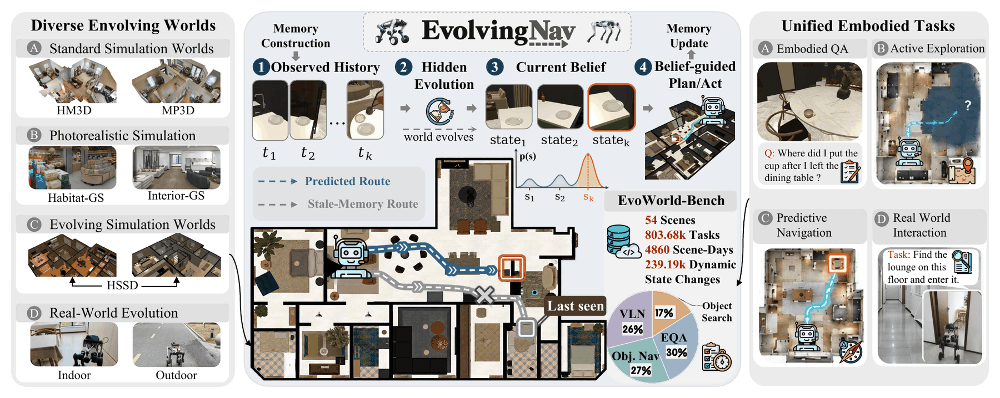
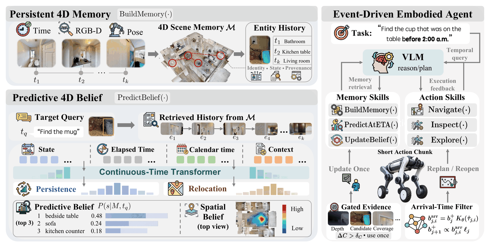
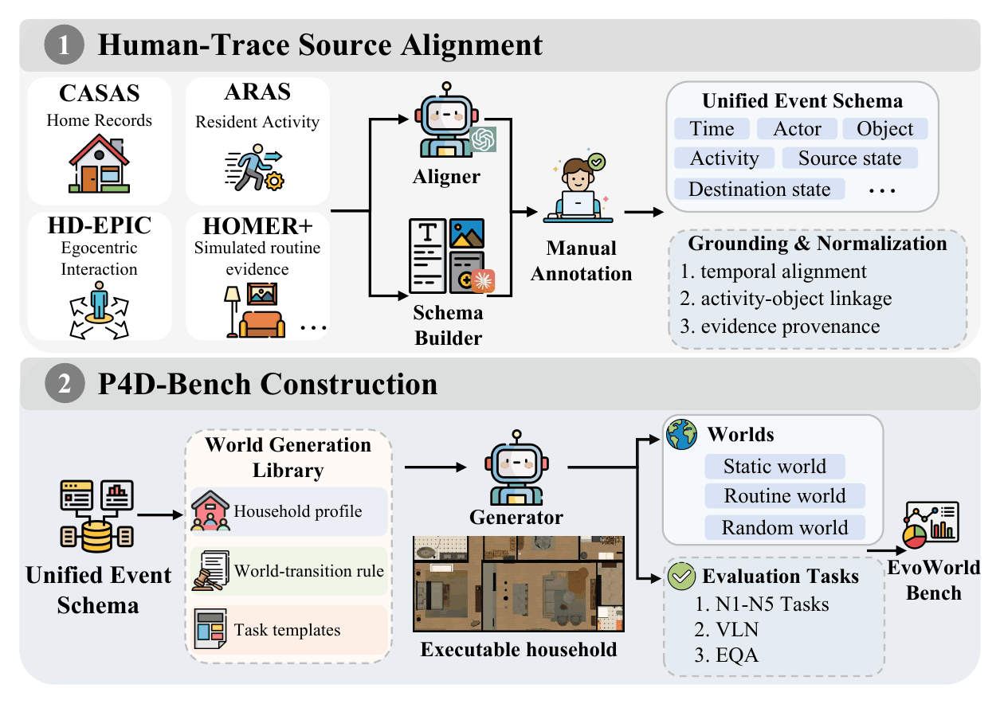
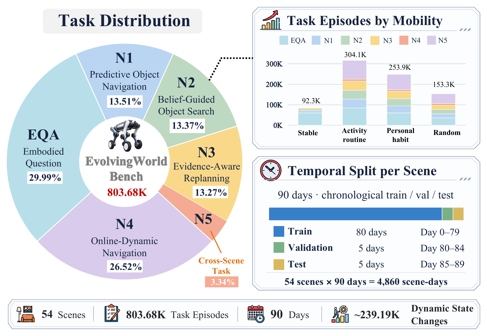
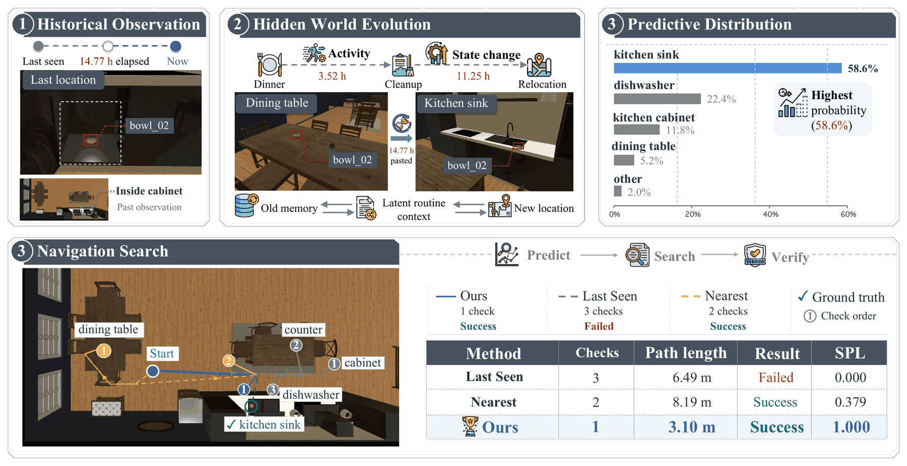
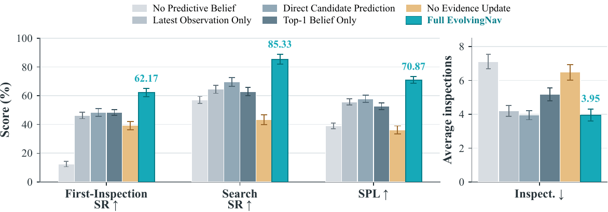
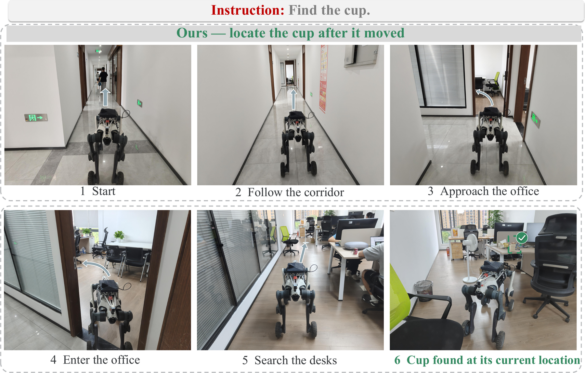
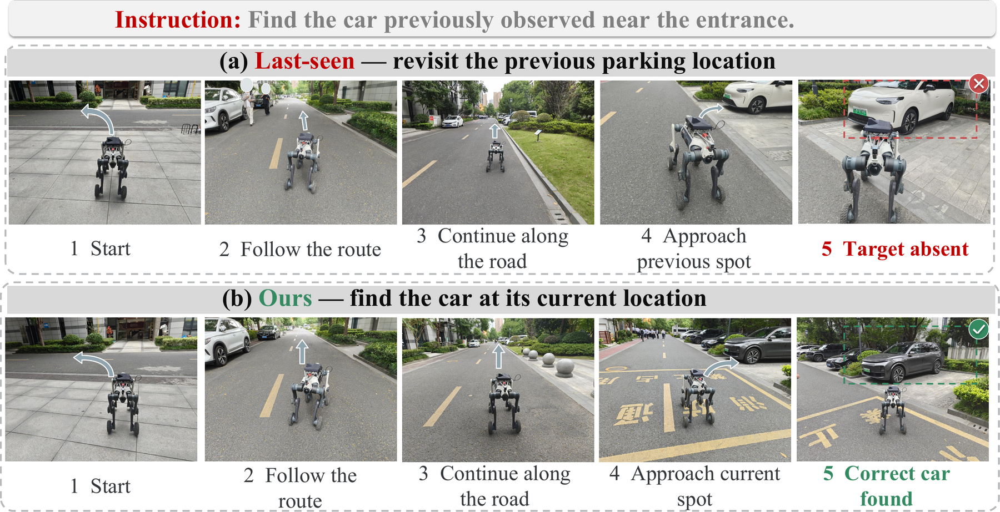

# Beyond the Remembered World

### Predictive 4D Belief for Persistent Navigation in Evolving Worlds

**EvolvingNav** is an embodied navigation agent that maintains a predictive belief over the current world when objects evolve during observation gaps and while the agent is navigating.

  <a href="main.pdf">Paper</a> &nbsp;·&nbsp;
  <a href="https://dcdmllm.github.io/EvolvingNav/">Project page</a> &nbsp;·&nbsp;
  <a href="https://github.com/fengnian123/DR-AgentOS">Code repository</a>

  

## Abstract

Persistent embodied agents must act from memories that can become stale: objects may move while the agent is away, continue evolving during navigation, and remain hidden after an inspection. EvolvingNav turns timestamped 3D entity histories into a persistence–relocation belief over the current world. An event-driven filter forecasts object states at candidate arrival times, uses newly informative visibility-aware RGB-D evidence, and replans when evidence invalidates a candidate. The learned predictor runs inside a frozen zero-shot vision-language control loop.

We introduce **EvoWorld-Bench**, a human-trace-grounded benchmark with **54 scenes** and **803.68K executable tasks**. The benchmark evaluates predictive navigation, belief-guided search, evidence-aware replanning, online dynamics, transfer, and embodied question answering.

## Key idea

EvolvingNav keeps two questions separate:

1. **Persistence:** does the last observed state still hold?
2. **Relocation:** if it changed, where could the object have moved?

The agent preserves alternative hypotheses, forecasts them to the estimated arrival time, gathers evidence during navigation, and updates only hypotheses that should have been visible.

## Method

  

The method combines timestamped 3D memory, a continuous-time predictive model, arrival-time belief forecasting, short-horizon action, and visibility-qualified evidence updates in a closed loop:

**timestamped history → arrival-time belief → action → evidence → replan**

## EvoWorld-Bench

EvoWorld-Bench contains persistent temporal histories, controlled world evolution, causal observability, and executable navigation tasks. Figure 4 shows the benchmark construction pipeline; Figure 3 summarizes task distribution, mobility patterns, and evaluation protocols.

<table>
  <tr>
    <td width="50%" align="center">
      
       <b>Figure 4.</b> Human traces are aligned, grounded, normalized, and instantiated as executable evolving worlds.
    </td>
    <td width="50%" align="center">
      
       <b>Figure 3.</b> Task distribution, mobility regimes, temporal split, and evaluation protocols.
    </td>
  </tr>
</table>

The benchmark includes predictive object navigation, belief-guided object search, evidence-aware replanning, online-dynamic navigation, cross-scene transfer, and embodied question answering.

## Main results

| Benchmark / setting | Metric | EvolvingNav |
|:--|:--|--:|
| FindingDory | HL-SR ↑ | **53.22** |
| FindingDory | HL-SPL ↑ | **38.83** |
| GOAT-Bench | SR ↑ | **35.43** |
| EvoWorld-Bench | First-Inspection SR ↑ | **61.32** |
| EvoWorld-Bench | Search SR ↑ | **86.18** |
| EvoWorld-Bench | SPL ↑ | **70.15** |
| LYNX M20, 64 matched trials | First-Inspection / Search / Recovery SR ↑ | **34.4 / 48.4 / 24.3** |

On the physical robot evaluation, the mean travel distance is **43.8 m**. The paired evaluation shows the clearest predictive gains when world evolution contains learnable temporal regularities, while the visibility-aware update remains useful under broader dynamic conditions.

## Qualitative behavior

  

Arrival-time prediction proposes likely destinations, while newly visible evidence suppresses stale hypotheses and triggers recovery.

## Ablation study

  

The full model benefits from predictive transition modeling, retaining multiple candidate hypotheses, and visibility-aware evidence updates.

## Real-world evaluation

The paper includes indoor and outdoor LYNX M20 execution cases. The website uses the compact sequence-figure treatment from the paper rather than isolated product-style photographs.

<table>
  <tr>
    <td width="50%" align="center">
      
       <b>Indoor case.</b> The robot follows the remembered route and finds a relocated cup.
    </td>
    <td width="50%" align="center">
      
       <b>Outdoor case.</b> The robot rejects a stale parking location and recovers at the predicted current location.
    </td>
  </tr>
</table>

## Demonstrations

The project page contains twelve lightweight-linked demonstrations across HSSD, HM3D, and Habitat-GS. The video binaries remain in the separate `website-media` branch so that the paper/code repository stays easy to clone.

| Scene | Demonstrations |
|:--|:--|
| HSSD | [Predictive navigation](https://raw.githubusercontent.com/fengnian123/DR-AgentOS/website-media/videos/HSSD/hssd_demo1_predictive_navigation.mp4) · [Belief-guided search](https://raw.githubusercontent.com/fengnian123/DR-AgentOS/website-media/videos/HSSD/hssd_demo2_belief_search.mp4) · [Evidence replanning](https://raw.githubusercontent.com/fengnian123/DR-AgentOS/website-media/videos/HSSD/hssd_demo3_evidence_replanning.mp4) · [Predictive memory](https://raw.githubusercontent.com/fengnian123/DR-AgentOS/website-media/videos/HSSD/hssd_demo4_predictive_memory.mp4) |
| HM3D | [Open-vocabulary object navigation](https://raw.githubusercontent.com/fengnian123/DR-AgentOS/website-media/videos/HM3D/hm3d_demo1_open_vocabulary_objectnav.mp4) · [Cross-room search](https://raw.githubusercontent.com/fengnian123/DR-AgentOS/website-media/videos/HM3D/hm3d_demo2_long_range_cross_room_search.mp4) · [Sequential memory reuse](https://raw.githubusercontent.com/fengnian123/DR-AgentOS/website-media/videos/HM3D/hm3d_demo3_sequential_goal_memory_reuse.mp4) · [Uncertainty-aware exploration](https://raw.githubusercontent.com/fengnian123/DR-AgentOS/website-media/videos/HM3D/hm3d_demo4_uncertainty_aware_exploration.mp4) |
| Habitat-GS | [Arrival-aware navigation](https://raw.githubusercontent.com/fengnian123/DR-AgentOS/website-media/videos/Habitat-GS/habitat_gs_demo1_arrival_aware.mp4) · [En-route evidence](https://raw.githubusercontent.com/fengnian123/DR-AgentOS/website-media/videos/Habitat-GS/habitat_gs_demo2_enroute_evidence.mp4) · [Unknown-state exploration](https://raw.githubusercontent.com/fengnian123/DR-AgentOS/website-media/videos/Habitat-GS/habitat_gs_demo3_unknown_exploration.mp4) · [Re-open candidate](https://raw.githubusercontent.com/fengnian123/DR-AgentOS/website-media/videos/Habitat-GS/habitat_gs_demo4_reopen_candidate.mp4) |

## Repository structure

~~~text
.
├── index.html                         # project page
├── academic.css / site-*.css          # academic layout and styling
├── world-explorer.js                   # interactive 4D memory explorer
├── figures/                            # paper figures and web-rendered panels
└── assets/explorer/                    # HSSD scene provenance and map asset
~~~

## Citation

~~~bibtex
@inproceedings{evolvingnav2027,
  title     = {Beyond the Remembered World: Predictive 4D Belief for Persistent Navigation in Evolving Worlds},
  author    = {EvolvingNav authors},
  booktitle = {International Conference on Learning Representations},
  year      = {2027}
}
~~~
